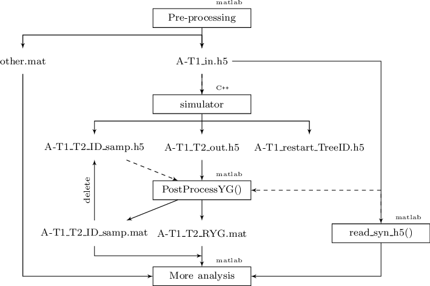

* [SpikeNet](#spikenet)
   * [Getting Started](#getting-started)
      * [Prerequisites](#prerequisites)
         * [FAQ](#faq)
      * [Installing](#installing)
      * [Run the demo](#run-the-demo)
* [High performance computing](#high-performance-computing)
* [The workflow](#the-workflow)
* [More details](#more-details)
* [Authors](#authors)
* [License](#license)
   
# SpikeNet
SpikeNet is a software that has three stand-alone components.
1. User interface for configuring spiking neuronal networks
2. A c++ simulator 
3. User interface for parsing and post-analyzing the simulation results.

The design of SpikeNet provides the following four main features.

* **Configurability** SpikeNet supports any user-defined structure of synaptic connectivity topologies, coupling strengths and conduction delays. It can be easily extended by developers to support any variations of integrate-and-fire neuron and synapse models.

* **Performance**  Simulation of spiking neuronal network quickly becomes computationally intensive if the number of neurons in the network exceeds a few thousand. To achieve superior performance, various measures have been taken at both algorithmic and implementation level. 

* **User-friendly interface** In SpikeNet, although c++ is used for heavy-duty computation, its user-interface is written in  high-level programming language (Matlab) for user-friendliness and fast prototyping. This means SpikeNet does not require non-developer users to be familiar with c++.

* **Scalability** The design of the SpikeNet c++ simulator readily supports parallel computing using Message Passing Interface (MPI). Additionally, the HDF5-based I/O file format provides big data handling capability. Also Portable Batch System (PBS) scripts for array jobs are provided if the you have access to a cluster.


# Getting Started

## Prerequisites
* Autoconf, a standard tool on OSX and linux distributions
* A c++ compiler that supports c++11 standard (GCC 4.2.1 or later; Intel C++ 12.0 or later)
* HDF5 c/c++ API (open source), e.g.,
```
brew install Homebrew/homebrew-science/HDF5
```
* Matlab (2013a or later) is optional but highly recommended
* Portable Batch System (PBS) is optional but highly recommended

### FAQ
Q: What if I am using Windows?

A: Sorry, you are on your own.

Q: What if I do not have Matlab or simply hate it?

A: You can either request I/O interface in Python from us or contribute to the project by translating the existing Matlab I/O interface into Python or other langangues.

## Installing

1. Ask for read permission from one of the contributors with admin rights.
2. Make a new directory
```
mkdir tmp
cd tmp
```
3. Clone the github repo
```
git clone https://github.com/BrainDynamicsUSYD/SpikeNet
```
4. Build the c++ simulator
```
cd SpikeNet
autoconf
./configure
make
make clean
cd ..
```

## Run the demo

Now you should see the simulator in the current directory, with which you can run simulations by creating input files using the Matlab user interface.
Following are the steps to use the Matlab user interface.
1. Make a new directory for storing data
```
mkdir tmp_data
```
2. Start Matlab and set up the environment (in Matlab)
```
cd SpikeNet
addpath(genpath(cd))
```
4. Generate the example input files (in Matlab)
```
cd ../tmp_data
main_demo
```
5. Run the simulator with the input file
```
cd tmp_data
../simulator *in.h5
```
6. Parse the output files into matlab .mat file, run some basic post-processing (in Matlab)
```
cd ../tmp_data
PostProcessYG()
```
7. Load the .mat file and do some basic visualization (in Matlab)
``` 
d = dir('*RYG.mat')
R = load(d(1).name)}
raster_plot(R,1)
```

# High performance computing

For those who have access to a high-performance computing cluster with PBS, SpikeNet also provides bash script that fully automates the above Matlab --> c++ --> Matlab workflow for PBS job array submission. 
The script all_in_one.sh has the following features:
1. It automatically detects which stage each array job (with a unique 4-digit integer array ID) has reached: pre-processing done, simulation done or post-simulation data parsing done. 
2. It will start each array job from the last unfinished stage instead of the first stage. This feature comes in handy when hundreds of array jobs end prematurely at different stages, say, due to the HPC being shut down unexpectedly, in which case simply a re-submission of the script will clean up the mess.
3. It passes the array ID as an input argument to the matlab pre-processing script.
4. It automatically saves a copy of the pre-processing Matlab script to the data directory when starting the array job with ID 0001.

Following are the steps to use the PBS script to run your arry jobs.
1. Make sure you have set up your PBS environment correctly (e.g., modelue load HDF5-1.10.0) and rebuild the c++ simulator.
2. Go to the tmp director and make a copy of the script
``` 
cp SpikeNet/other_scripts/all*bak all_in_one.sh
```
3. Change it to executable
```
chmod +x all_in_one.sh
```
4. Edit the following variables in the bash script accordingly: 
```
MATLAB_SOURCE_PATH_2=`your_path'
MATLAB_PRE_PROCESS_FUNC=`your_functions'
```
5. Make a directory for PBS output
```
mkdir PBSout
```
6. Submit the PBS array job 
```
qsub -t 1-X -q queue_name all_in_one.sh
```
If your version PBS system uses `-J` instead of `-t` for array job, you also need to change `$PBS_ARRAYID` into `$PBS_ARRAY_INDEX` in the all_in_one.sh script.

7. Once the array job is finished, you can collect the data from the array job for post-analysis, for example (in matlab)
```
cd tmp_data
[mean_firing_rate, arrayID] = CollectVectorYG('Analysis','mean(Analysis.rate{1})');
plot(arrayID, mean_firing_rate);
```
8. Be aware that the seed for random number generator in PBS arry jobs may need to be manually set or remains as constant otherwise.

# The workflow

The typical workflow of SpikeNet is as shown in the following flowchart.



Notes:
* Although the c++ simulator accepts input files with any names, **A-T1** is the recommended and default naming format.
* **A** is a 4-digit PBS array ID number.
* **T1** is a timestamp identifying when the **in.h5** file was generated.
* Similarly, **T2** is a timestamp identifying when the **out.h5** file was generated, which allows multiple simulations to be run for the same **in.h5** file.
* The **restart\_TreeID.h5** files allow the users to directly modify any aspect of a simulation and restart it from there. 
* The **TreeID** is automatically generated to ensure that the users can make as many different modifications and restart the simulation as many times as desired.
* For technical reasons, the time series data sampled from each neuron population or synapse group, identified by an ID number, during simulation are stored in separate **samp.h5** files.
* The dashed lines mean that the c++ simulator and the PostProcessYG() matlab function will automatically look for those auxiliary input files based on the information contained in the main input files.

# More details 
For MPI jobs with SpikeNet, please contact Yifan Gu for more technical details.

Also the full documentation is available [here](https://github.com/BrainDynamicsUSYD/SpikeNet/blob/master/documentation/SpikeNet_Documentation.pdf).

# Authors

* **Yifan Gu** - *Initial work* - [yigu8115](https://github.com/yigu8115)
* **James A Henderson** - *HDF5-based I/O and learning schemes* - [JamesAHenderson](https://github.com/JamesAHenderson)

See also the list of [contributors](https://github.com/BrainDynamicsUSYD/SpikeNet/graphs/contributors) who participated in this project.

# License

This project is licensed under the Apache License 2.0 - see the [LICENSE.md](LICENSE.md) file for details.


